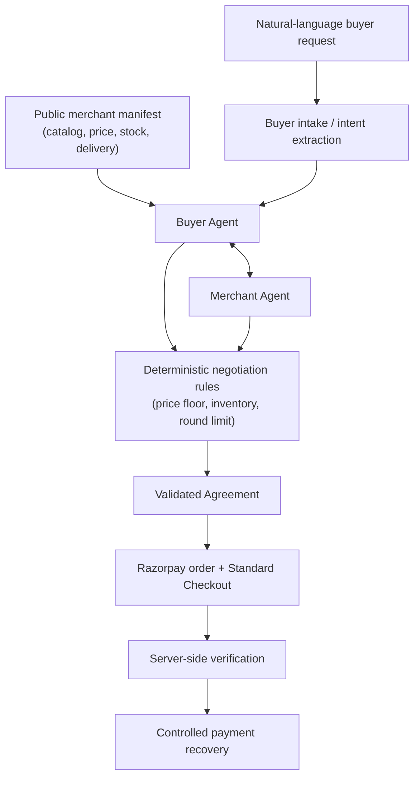

# PACT

**AI-to-AI commerce negotiation.**

PACT makes a merchant understandable *and transactable* by an AI buyer. A
buyer states a requirement in plain language; a Buyer Agent negotiates it
against a Merchant Agent that is bounded by the merchant's real inventory and
private pricing rules; if the two sides reach terms, PACT creates a real
agreement and settles it through Razorpay.

The hero feature is not a chatbot. It's a bounded, multi-round negotiation
between two agents with genuinely different objectives, that can end in a
real commercial agreement — or in a clean, explained refusal.

- **Buyer Agent** — understands the buyer's requirement and negotiates
  toward it: prefers a lower price, may trade quantity or delivery time for
  price, can hold its position or walk away.
- **Merchant Agent** — operates against real catalog inventory, is bounded
  by a private price floor it never reveals, and balances price against
  quantity and delivery.
- **PACT** — validates every proposed move deterministically, creates the
  agreement, routes it into a real Razorpay payment, and supports a
  controlled recovery path if that payment fails.

## The problem

Traditional commerce assumes a human at the other end: `human → website →
checkout`. Agentic commerce changes who's asking:

```
AI buyer → merchant
```

A product page an LLM can *read* isn't enough — an AI buyer also needs a
merchant it can actually *transact* with, under commercial constraints
(price, stock, delivery) that are explicit rather than implied by a web
page's copy. PACT explores that missing negotiation layer: a small,
self-contained system where an AI buyer and a merchant's own agent can
negotiate bounded terms and settle them, without a human relaying offers
back and forth.

## The core idea: LLM proposes, deterministic code disposes

Every negotiated number in PACT — every price, every quantity, every
delivery day, every accept/reject/walk-away — is decided by plain,
deterministic TypeScript. The LLM's job is narrower and comes *after* the
decision:

- interpreting the buyer's natural-language requirement into structured
  fields
- phrasing an already-decided negotiation move as a natural-language
  message
- explaining an already-decided outcome in plain English

The LLM never sees the merchant's private price floor, never picks a price,
and never decides whether a deal is acceptable. If an LLM-phrased message
fails an integrity check (e.g. it states a number that isn't the real,
already-decided one), the deterministic fallback message — built from the
same real data — is used instead. If no LLM provider is configured at all,
negotiation still runs to completion with deterministic captions in place of
LLM prose; every price, quantity, delivery day, and outcome is identical
either way.

This matters because an LLM can *suggest* a deal — it must never be the
authority that decides whether money or inventory actually moves.

## How PACT works



Each round is one real buyer→merchant exchange: the buyer's current
position is evaluated against the merchant's real catalog item and current
offer, a deterministic rule engine decides the next move for each side
(concede, hold, trade quantity/delivery for price, accept, or walk away),
and only then is that move phrased in natural language. The exchange
repeats, bounded by a round limit, until one side accepts, the round limit
is reached, or the negotiation is structurally unwinnable (the buyer's
ceiling is below the merchant's floor) and both sides walk away with an
explanation.

## Why this is actually agentic

The two agents don't share an objective, and neither is scripted to a fixed
script of moves:

| | Buyer Agent | Merchant Agent |
|---|---|---|
| Wants | to satisfy its stated requirement | to maximize commercial value |
| Bounded by | its own budget ceiling, delivery deadline | real inventory, a private price floor, delivery capacity |
| Can | concede, trade quantity/delivery for price, hold, walk away | counter, concede (gradually, from listed price — never straight to the floor), hold, reject |
| Never reveals | its true ceiling up front | its price floor, ever |

Negotiation is multi-round and stateful — each side's next move is computed
against the *other* side's most recent real offer, not a pre-written
sequence. To be explicit about what the LLM does **not** do: it does not
independently control money, inventory, or authorization at any point in
this flow. Every one of the moves in the table above is selected by
deterministic code before any LLM call happens.

## A real negotiation

This is PACT's own demonstration scenario — a fixed input run through the
real engine, not a scripted transcript:

**Buyer requirement:** 7 units, maximum ₹46,500/unit, delivery within 8
days (flexible on delivery for a better price).

| Round | Buyer offer | Merchant offer | What happened |
|---|---|---|---|
| R1 | ₹44,175 | ₹46,541 | Merchant counters below listed price (₹48,000), above its floor |
| R2 | ₹44,175 | ₹45,492 | Buyer trades delivery (8 → 12 days) for a better price |
| R3 | — | — | Buyer accepts the merchant's R2 offer |

**Final agreement:** 7 units · ₹45,492/unit · 12-day delivery · **₹3,18,444
total.**

This is a demonstration scenario against seeded catalog data, not a live
merchant's real prices.

## The AI-readable merchant layer

`GET /api/manifest` is what a buyer agent reads before it ever states a
requirement. It returns the merchant's profile and catalog — SKU, name,
description, listed price, available quantity, standard/max delivery days,
and whether the item is negotiable — built by explicitly whitelisting each
field onto a public DTO rather than serializing the database record
directly.

**The merchant's private price floor (`CatalogItem.minPrice`) is never part
of this manifest, and is never sent to the browser or to any LLM prompt** —
it's read only inside the deterministic rule engine, server-side. The
merchant's own `/dashboard` view is the one place it's shown, to the
merchant.

## Conversational buyer intake

A buyer can state their requirement in plain language and PACT resolves it
incrementally rather than demanding a rigid form:

- PACT asks only for whatever is still missing (product, quantity, budget,
  delivery), never re-asking something already given.
- A product or specification the catalog genuinely doesn't carry (a
  different category, or an unavailable configuration like a RAM size that
  doesn't exist) is surfaced explicitly, with the real catalog options —
  never guessed at or silently substituted.
- A question ("what's the listed price?", "how much stock do you have?")
  is answered from the real catalog without mutating anything the buyer has
  already stated.
- Corrections ("actually make that 7", "my budget is 46k not 42k") are
  applied to the right field conversationally.

Parsing free text is inherently the LLM's job, but the field this text
resolves to is decided deterministically wherever practical — a natural
answer to whatever field was just asked about, an unavailable-product
mention, or a specification mismatch is each recognized by plain pattern
matching before (and independent of) any LLM call, specifically so a parser
misfire can't silently drop an already-confirmed requirement.

## Payment

```
Agreement → server-side Razorpay order → Standard Checkout → server-side verification → Agreement/payment state
```

Once two agents reach terms, PACT creates the Agreement first — a payment
can only ever be created from a valid, already-negotiated Agreement, never
independently. The client requests a Razorpay order for that Agreement,
opens Razorpay's own Standard Checkout, and the resulting payment is
verified **server-side** (signature verification) before the Agreement is
marked paid; a Razorpay webhook is also handled as a second, independent
confirmation path. PACT runs against **Razorpay Test Mode** for this
Buildathon.

If a payment fails, PACT supports one bounded recovery attempt against the
same Agreement rather than treating a failed attempt as the end of the
line (see [Failure & recovery](#failure--recovery)).

## Failure & recovery

Real problems surfaced during development. Here's what broke and how it was
handled — not to make the project sound fragile, but because that's the
honest account.

**1. LLM provider rate-limiting (HTTP 429).** An LLM provider occasionally
rejects a request outright under load. Left unhandled, this would surface
as an application error mid-negotiation. It's now a distinct,
recognized failure mode (`ProviderRateLimitedError`) that both agents catch
the same way they already catch "no API key configured" — falling back to
a deterministic message built from the same real, already-decided numbers.
The negotiation itself is never affected; only the phrasing degrades.

**2. A Razorpay decline isn't always the end of a payment attempt.**
Razorpay Checkout's retry option stays enabled, so a single declined
attempt can be followed by a genuinely successful payment against the
*same* order — confirmed directly against Razorpay Test Mode (the order
settled as paid while PACT had already recorded the attempt as failed).
Terminalizing an attempt on the first decline was wrong. A browser-reported
decline is now recorded as audit-only information; only a verified
signature or an authoritative webhook event resolves an attempt's real
final state, and that resolution is written so a later genuine success can
still land even if an earlier failure was already recorded for the same
order.

**3. Conversational intake edge cases.** Free-text intake surfaced real
parser edge cases during development: a product the catalog doesn't carry
being mistaken for "no product stated," a specification correction (e.g.
"12GB, not 16GB") being misread as a new quantity, and a natural-language
field correction losing to an unrelated check. Each was fixed with a
deterministic precedence rule — a valid answer to whatever field was just
asked about, and a genuine spec/product mismatch, are both recognized
*before* falling through to the general-purpose parser, so a parser
regression can't silently overwrite or drop an already-confirmed
requirement.

**4. Dashboard freshness.** An abandoned negotiation (a closed tab, an
interrupted test run) would otherwise sit in an "active" count forever.
The merchant dashboard now only counts a negotiation as active if it was
updated within the last 30 minutes — a bound generous enough that no real
in-progress negotiation (which typically completes in well under a minute)
is ever misclassified.

## Security / trust boundaries

- The merchant's private price floor (`CatalogItem.minPrice`) is never part
  of the public manifest and is never sent to an LLM prompt.
- All secrets (LLM API keys, Razorpay key secret, Razorpay webhook secret)
  live only in environment variables, read server-side.
- Razorpay payment verification happens server-side; the browser never
  determines whether a payment succeeded.
- Deterministic business rules — not the LLM — are the sole authority over
  price, quantity, inventory, delivery terms, round limits, agreement
  validity, and payment/recovery state.

## Tech stack

- [Next.js](https://nextjs.org) 16 (App Router, TypeScript) — single app
- [React](https://react.dev) 19
- [Tailwind CSS](https://tailwindcss.com) 4
- [Prisma](https://www.prisma.io) 7 + SQLite (`better-sqlite3` driver
  adapter) for local data
- [Razorpay](https://razorpay.com) Standard Checkout (`razorpay` SDK) for
  payment
- LLM: [Anthropic Claude](https://www.anthropic.com) (default) or
  [Google Gemini](https://ai.google.dev) (`@google/genai`), behind a
  provider-agnostic interface
- [Vitest](https://vitest.dev) for the test suite, [ESLint](https://eslint.org)
  for linting

## Project structure

```
prisma/
  schema.prisma         Data model
  migrations/
  seed.ts                Seeds one demo merchant + a small catalog
src/
  app/
    page.tsx              Landing page
    dashboard/             Merchant console (includes the private price floor)
    negotiate/             The live negotiation UI (conversational intake,
                            negotiation graph, Decision Trace, payment)
    api/
      manifest/             GET  /api/manifest             — public AI-readable catalog
      negotiations/          POST /api/negotiations         — create a negotiation session
      negotiations/intent/   POST /api/negotiations/intent  — parse free-text buyer intent
      negotiations/[id]/turn/       POST — advance one negotiation round
      negotiations/[id]/agreement/  GET  — fetch a session's agreement
      negotiations/[id]/audit-trail/ GET — fetch a session's audit trail
      agreements/[id]/payment/      Razorpay order / verify / recover / report-failure
      payments/webhook/             Razorpay webhook handler
  lib/
    agents/                Buyer/Merchant Agent — deterministic decision + LLM-phrased message
    negotiation/            Orchestrator, buyer intent parser, session/agreement persistence
    rules/                  Deterministic negotiation engine, concession strategy, trade
                            evaluation, walk-away detection, catalog rules — pure, unit-tested
    payment/                Razorpay client, payment service, recovery, mock adapter for tests
    llm/                    Provider-agnostic LLM interface + Claude/Gemini implementations
    manifest.ts             Builds the public (privacy-safe) manifest DTO
  types/                   Shared request/response DTOs
```

## Local setup

```bash
npm install
cp .env.example .env
npx prisma migrate dev
npx prisma db seed
npm run dev
```

Open `http://localhost:3000` — `/negotiate` runs the AI-to-AI negotiation
demo, `/dashboard` shows the merchant's own view (including the private
price floor).

`DATABASE_URL` is the only variable required to run the app at all. Without
an LLM provider key, negotiation still runs end to end with deterministic
captions in place of LLM-phrased prose. Without Razorpay credentials,
`PAYMENT_PROVIDER=mock` (see below) runs the real payment state machine
against a deterministic, network-free stand-in instead of the real Razorpay
API.

### Commands

```bash
npm run dev          # start the dev server
npm run build         # production build
npm run lint           # ESLint
npm test                # run the Vitest suite
npx tsc --noEmit          # type-check only
npx prisma studio          # browse the local SQLite database
npx prisma db seed          # re-seed demo data
```

## Environment variables

All variable *names* below come directly from [`.env.example`](.env.example)
— no secret values are included here or anywhere in this repository.

| Variable | Required for | Notes |
|---|---|---|
| `DATABASE_URL` | Everything | Local SQLite file path |
| `LLM_PROVIDER` | LLM-phrased messages | `claude` (default) or `gemini` |
| `ANTHROPIC_API_KEY` | Claude-phrased messages | Optional — falls back to deterministic captions if unset |
| `GEMINI_API_KEY` | Gemini-phrased messages | Optional, only used when `LLM_PROVIDER=gemini` |
| `PAYMENT_PROVIDER` | Payment | `razorpay` (default) or `mock` — `mock` is force-disabled outside development |
| `RAZORPAY_KEY_ID` | Razorpay Checkout | Razorpay's own public key identifier |
| `RAZORPAY_KEY_SECRET` | Razorpay order/verification | Server-side only, never sent to the browser |
| `RAZORPAY_WEBHOOK_SECRET` | Razorpay webhook | Server-side only, verifies webhook authenticity |

## Testing

Verified on this repository at release time:

```bash
npm test           # 53 test files, 1075 tests passing
npm run lint        # clean
npx tsc --noEmit      # clean
npm run build          # production build succeeds
```

The suite covers the deterministic rule engine (negotiation strategy,
concession math, trade evaluation, walk-away detection) as pure unit tests,
the buyer-intake pattern matching, the payment/recovery state machine
against a real (mocked) Razorpay flow, and the negotiation API routes
end-to-end against a real test database.

## Razorpay Buildathon

**Track 1 — AI Growth & Agentic Commerce.**

PACT belongs in this track because it addresses the piece of agentic
commerce that a product feed or a chat widget doesn't: a merchant-side
agent that can actually negotiate bounded commercial terms with an AI
buyer, under real inventory and pricing constraints, and hand off a
genuine agreement into a real Razorpay payment — with the LLM kept
strictly out of the decisions that move money or inventory.
